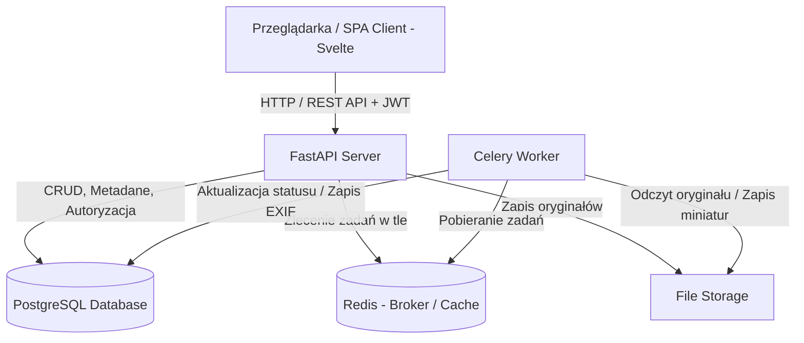
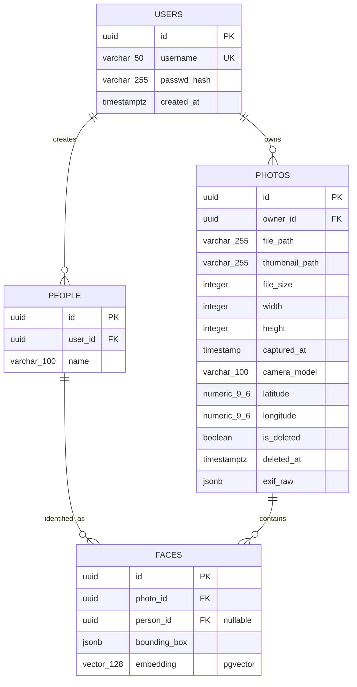

# 03. Architektura Systemu i Model Danych

## 1. Stos Technologiczny i Środowisko Uruchomieniowe

| Warstwa | Technologia / Narzędzie | Uzasadnienie wyboru |
| :--- | :--- | :--- |
| **Backend** | Python / FastAPI | Wysoka wydajność asynchroniczna (ASGI), natywne wsparcie dla typowania (Pydantic), automatyczna dokumentacja OpenAPI/Swagger. |
| **Frontend** | Svelte / SvelteKit | Lekkość, brak wirtualnego DOM (kompilacja do czystego JS), wysoka reaktywność i szybki czas renderowania galerii. |
| **Baza danych** | PostgreSQL | Niezawodny relacyjny silnik bazodanowy, silne wsparcie dla indeksowania, transakcji ACID oraz typów JSONB (na elastyczne metadane). |
| **Przetwarzanie w tle (in progress)** | Celery + Redis | Asynchroniczna kolejka zadań do ciężkich operacji (skalowanie obrazów, ekstrakcja EXIF, tworzenie miniatur) bez blokowania API. |
| **Storage plików** | Lokalne wolumeny Docker | Przechowywanie oryginalnych plików i wygenerowanych miniatur w strukturze opartej o identyfikatory UUID. |
| **Konteneryzacja** | Docker & Docker Compose | Spójne środowisko uruchomieniowe, łatwe wdrożenie i pełna powtarzalność instalacji na dowolnej maszynie. |

---

## 2. Diagram Architektury Systemu



## 3. Logiczny Model Danych

### 3.1 Schemat Encji

## 4. Główne kontrakty

### 4.1 Uwierzytelnianie (/api/v1/auth) - [IN_PROGRESS]

    - POST /register - Rejestacja nowego konta ( {username, password} -> [201] Created )
    - POST /login - logowanie i wydanie tokenów ( {username, password } -> {access_token, refresh_token })
    - POST /refresh - odświeżenie tokenu sesyjnego

### 4.2 Zasoby i Multimedia (/api/v1/photos) - [IN_PROGRESS]
    - GET / - Lista zdjęć zalogowanego użytkownika (parametry query: page, page_size, tag_id, album_id, sort_by) 
  
    - POST /upload - przesyłanie jednego bądź wielu plików ()
  
    - GET /{id} - szczegółowe dane zdjęcia wraz z obiektem metadanych i tagami

    - GET /{id}/file - serwowanie oryginalnego pliku graficznego

    - GET /{id}/thumbnail - serwowanie zoptymalizowanej miniatury

    - DELETE /{id} - usunięcie zdjęcia z bazy oraz skasowanie plików z dysku

### 4.3 Albumy i kolekcje (/api/v1/albums) - [IN_PROGRESS]
    - GET / - lista albumów użytkownika z liczbą elementów i miniaturą okładki.

    - POST / - utworznie nowego albumu

    - POST /{id}/photos - dodanie zbioru zdjęć do albumu ( { photo_ids: [...] } )

    - DELETE /{id}/photos/{photo{id}} - usunięcie powiązania zdjęcia z albumem

## 5. Przepływ Przetwarzania Danych 

1. [Klient/Svelte] -> Wysyła plik graficzny (POST /photos/upload) z nagłówkiem Authorization.
2. [FastAPI API]   -> Waliduje token JWT, sprawdza nagłówek MIME i rozmiar pliku.
3. [FastAPI API]   -> Generuje photo_id (UUID), zapisuje plik tymczasowo/docelowo w storage.
4. [FastAPI API]   -> Tworzy wpis w tabeli PHOTOS ze statusem "PENDING".
5. [FastAPI API]   -> Emituje zadanie do kolejki Redis (np. process_photo_task.delay(photo_id)).
6. [FastAPI API]   -> Zwraca natychmiastową odpowiedź HTTP 202 Accepted (nie blokuje klienta).
7. [Celery Worker] -> Pobiera zadanie z Redis: 
    - a) Odczytuje plik z dysku,
    - b) Parsuje metadane EXIF przy użyciu biblioteki graficznej/Pillow/ExifRead,
    - c) Generuje miniatury (np. 400px szerokości, kompresja WebP),
    - d) Zapisuje miniaturę w storage,
    - e) Tworzy rekord w tabeli METADATA,
    - f) Zmienia status zdjęcia w tabeli PHOTOS na "COMPLETED".

8. [Klient/Svelte] -> Odpytuje o status lub odświeża listę, pobierając wygenerowane miniatury.

## 6. Środowisko Uruchomieniowe i Wdrożenie (Docker Compose)

Całe środowisko developerskie oraz produkcyjne jest w pełni skonteneryzowane za pomocą Docker Compose. Składa się z trzech ściśle współpracujących usług połączonych wspólną siecią mostkową (`photo-network`).

### 6.1. Zdefiniowane usługi

1. **Baza Danych (`db`):**
   - **Obraz:** `ankane/pgvector:v0.5.1` (PostgreSQL ze wstępnie skompilowanym rozszerzeniem wektorowym).
   - **Inicjalizacja:** Montowanie katalogu `./init-db` do `/docker-entrypoint-initdb.d` w celu automatycznego wykonania skryptu `init.sql` przy pierwszym starcie.
   - **Persystencja danych:** Nazwany wolumen `postgres_data`.

2. **Backend API (`backend`):**
   - **Środowisko:** Python / FastAPI, port `8000`.
   - **Wolumeny:** 
     - `./backend:/app` (Live reload kodu podczas developmentu).
     - `./storage:/app/storage` (Trwały magazyn na oryginalne pliki zdjęć i wygenerowane miniatury).
   - **Zależności:** Startuje po uruchomieniu bazy (`depends_on: [db]`).

3. **Frontend SPA (`frontend`):**
   - **Środowisko:** Svelte / SvelteKit + Vite, port `5173`.
   - **Zmienne środowiskowe:** `VITE_API_URL=http://localhost:8000` (adres punktu wejściowego API).
   - **Zależności:** Startuje po uruchomieniu backendu (`depends_on: [backend]`).

---

### 6.2. Konfiguracja `docker-compose.yml`

```yaml
services:
  db:
    image: ankane/pgvector:v0.5.1
    container_name: prismato_db
    restart: always
    environment:
      POSTGRES_USER: ${POSTGRES_USER}
      POSTGRES_PASSWORD: ${POSTGRES_PASSWORD}
      POSTGRES_DB: ${POSTGRES_DB}
    ports:
      - "5432:5432"
    volumes:
      - postgres_data:/var/lib/postgresql/data
      - ./init-db:/docker-entrypoint-initdb.d
    networks:
      - photo-network

  backend:
    build: ./backend
    container_name: prismato_backend
    volumes:
      - ./backend:/app
      - ./storage:/app/storage
    environment:
      POSTGRES_USER: ${POSTGRES_USER}
      POSTGRES_PASSWORD: ${POSTGRES_PASSWORD}
      POSTGRES_DB: ${POSTGRES_DB}
    ports:
      - "8000:8000"
    depends_on:
      - db
    networks:
      - photo-network

  frontend:
    build: ./frontend
    container_name: prismato_frontend
    volumes:
      - ./frontend:/app
      - /app/node_modules
    environment:
      - VITE_API_URL=http://localhost:8000
    ports:
      - "5173:5173"
    networks:
      - photo-network
    depends_on:
      - backend

networks:
  photo-network:
    driver: bridge

volumes:
  postgres_data: